# DevForge -- LangChain Architecture

## What LangChain Does in This App

LangChain.js is the **AI orchestration layer** that lives entirely on the backend (`netlify/functions/lib/ai/`). The frontend never touches LangChain -- it only sends typed requests and receives typed JSON responses.

LangChain handles three things for us:

1. **Provider abstraction** -- One codebase that works with both OpenAI and Anthropic
2. **Structured output** -- AI responses come back as typed objects, not raw text
3. **Chain composition** -- Input transformation, prompt, and model wired together as a single callable unit

### System Overview

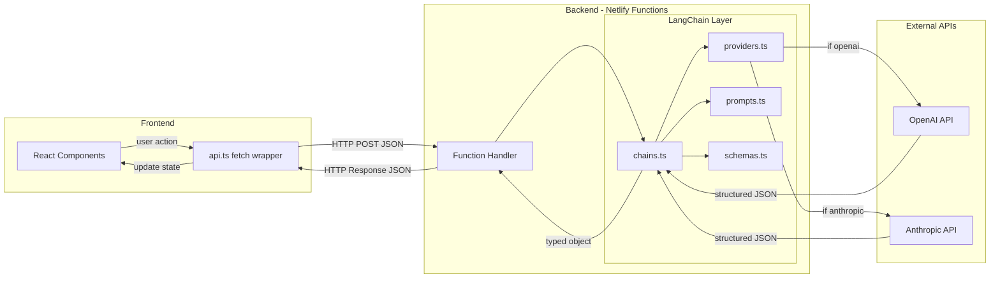

---

## File Map

```
netlify/functions/lib/ai/
  providers.ts    Model factory (OpenAI or Anthropic)
  schemas.ts      Zod schemas defining what the AI must return
  prompts.ts      Prompt templates with variable placeholders
  chains.ts       Chains that wire it all together
```

### Dependency Flow

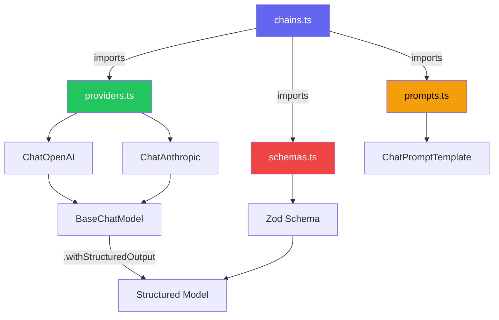

---

## Layer 1: Providers (`providers.ts`)

The provider layer is a factory function that returns a LangChain chat model based on user settings.

```typescript
function getModel(settings: AppSettings): BaseChatModel
```

### Provider Selection

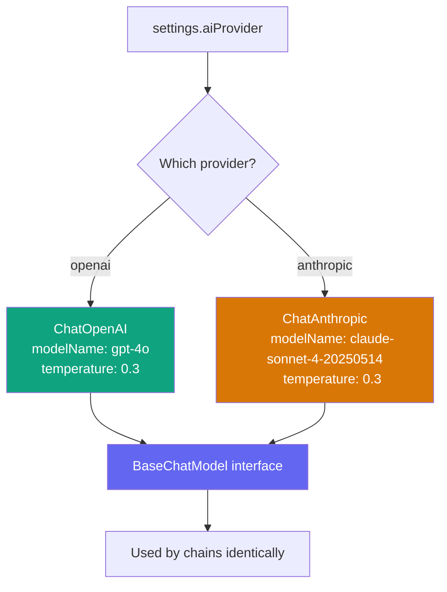

Both `ChatOpenAI` and `ChatAnthropic` implement `BaseChatModel`, which means every downstream consumer (chains, structured output) works identically regardless of which provider is active.

### Provider Switching End-to-End

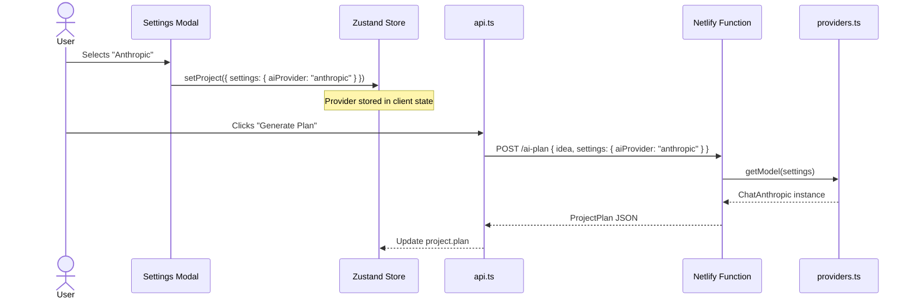

The user can switch providers between steps. Each chain is constructed fresh per request.

---

## Layer 2: Schemas (`schemas.ts`)

Zod schemas define the **exact shape** of what the AI must return. They serve as both a contract and enforcement mechanism.

### Schema Map

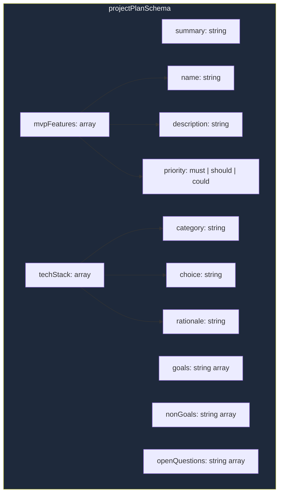

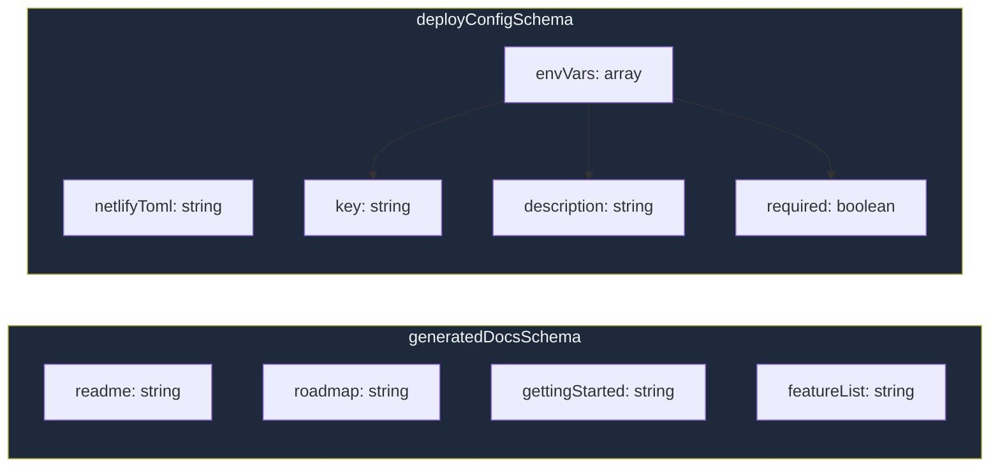

### The `.describe()` calls matter

Each field and array has a `.describe()` annotation:

```typescript
goals: z.array(z.string()).describe('3-5 project goals')
```

LangChain passes these descriptions to the model as part of the function/tool definition. The AI reads them as instructions -- "give me 3-5 items" -- which guides the output quality without needing it in the prompt.

---

## Layer 3: Prompts (`prompts.ts`)

Prompts are defined using `ChatPromptTemplate.fromMessages()`, which creates a reusable template with variable placeholders (`{variableName}`).

### Three Prompts

| Prompt | System Role | Human Message Variables |
|--------|-------------|------------------------|
| **plannerPrompt** | Senior software architect | `{description}`, `{tags}`, `{constraints}`, `{goals}` |
| **docsPrompt** | Technical writer | `{planJson}`, `{repoName}`, `{techStack}` |
| **deployPrompt** | DevOps engineer | `{techStack}`, `{projectType}`, `{hasApi}` |

### Prompt Structure

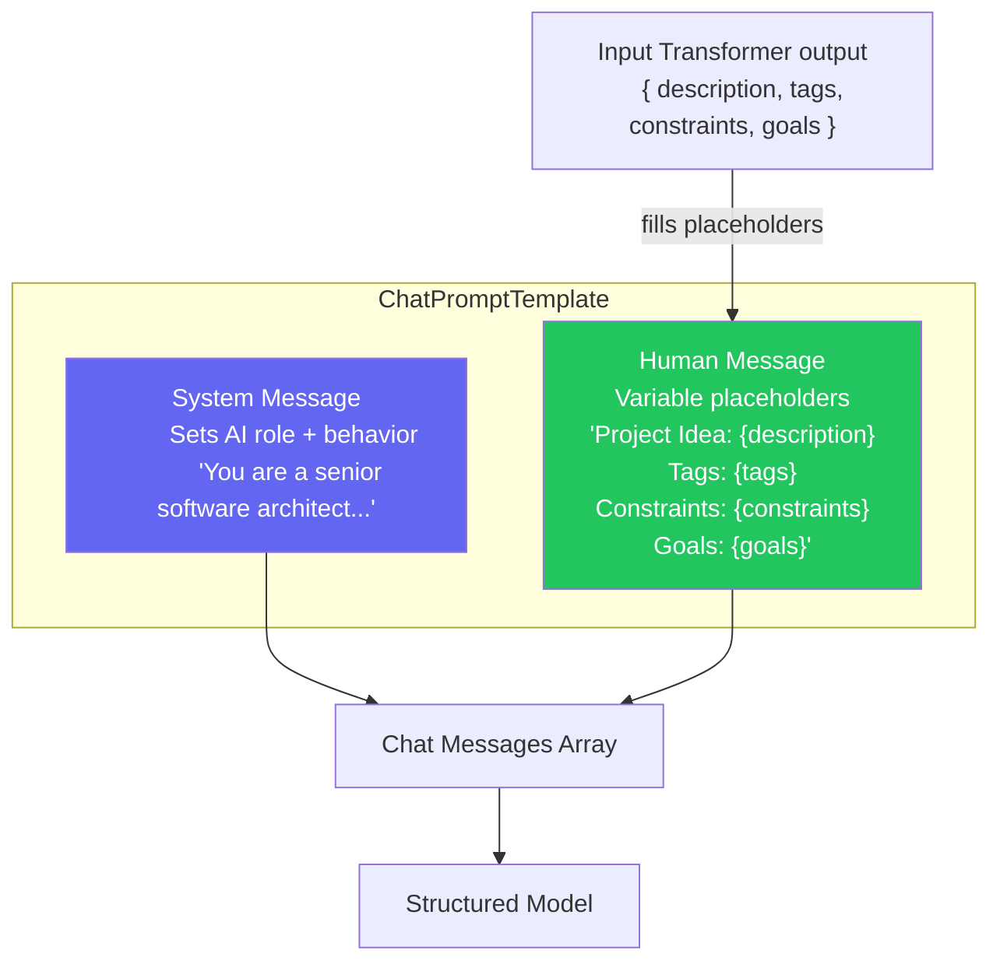

The `{description}`, `{tags}`, etc. are not hardcoded -- they get filled by the input transformer in the chain (Layer 4 below).

---

## Layer 4: Chains (`chains.ts`)

Chains are where everything connects. Each chain is a `RunnableSequence` -- a pipeline of steps that execute in order.

### Anatomy of a Chain

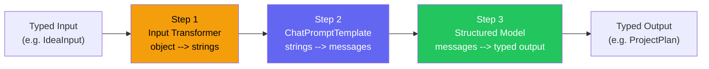

### Planner Chain -- Full Data Flow

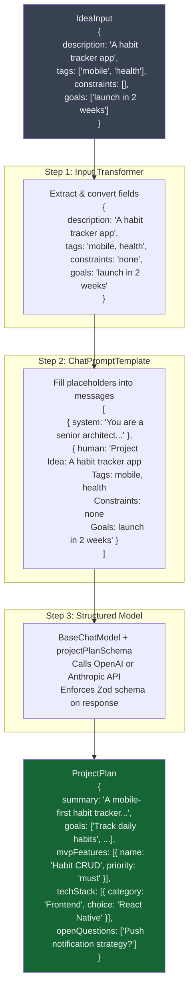

### All Three Chains Compared

```mermaid
graph TD
    subgraph Planner Chain
        P_IN[IdeaInput] --> P_TR[Transform] --> P_PR[plannerPrompt] --> P_SM["withStructuredOutput
        (projectPlanSchema)"] --> P_OUT[ProjectPlan]
    end

    subgraph Docs Chain
        D_IN["{ plan, repoName }"] --> D_TR[Transform] --> D_PR[docsPrompt] --> D_SM["withStructuredOutput
        (generatedDocsSchema)"] --> D_OUT[GeneratedDocs]
    end

    subgraph Deploy Chain
        DE_IN["{ techStack, projectType, hasApi }"] --> DE_TR[Transform] --> DE_PR[deployPrompt] --> DE_SM["withStructuredOutput
        (deployConfigSchema)"] --> DE_OUT[DeployConfig]
    end

    style P_OUT fill:#166534,color:#fff
    style D_OUT fill:#166534,color:#fff
    style DE_OUT fill:#166534,color:#fff
    style P_IN fill:#374151,color:#f3f4f6
    style D_IN fill:#374151,color:#f3f4f6
    style DE_IN fill:#374151,color:#f3f4f6
```

---

## How `.withStructuredOutput()` Works Under the Hood

This is the most important LangChain concept in DevForge.

```typescript
const structuredModel = model.withStructuredOutput(zodSchema);
```

### OpenAI vs Anthropic -- Different Mechanisms, Same Result

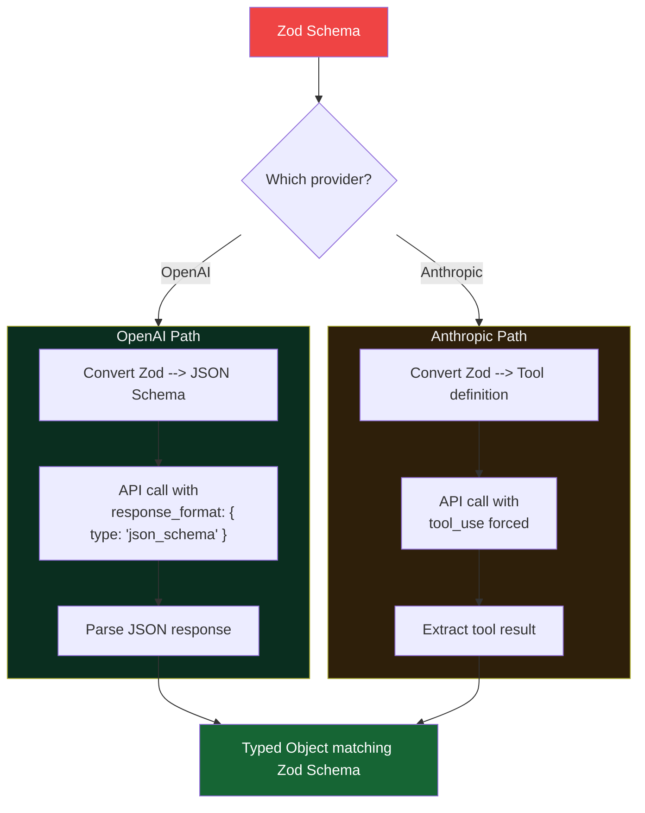

### Why this matters

Without `.withStructuredOutput()`, you would need to:

1. Ask the AI to "respond in JSON" in the prompt (unreliable)
2. Parse the raw text response as JSON (might fail)
3. Validate against your schema (might not match)
4. Retry if parsing fails (adds latency)
5. Handle all this differently for OpenAI vs Anthropic

With `.withStructuredOutput()`, you write one line and get a guaranteed typed object back.

---

## How Chains Connect to Netlify Functions

Each chain is created and invoked inside a Netlify Function handler. The function is the thin HTTP wrapper; the chain does all the AI work.

### Request Lifecycle

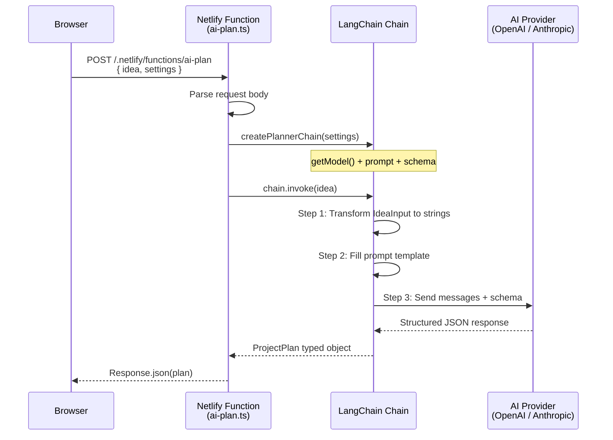

Example from `ai-plan.ts`:

```typescript
export default async (req: Request) => {
  const body = await req.json();                     // { idea, settings }
  const chain = createPlannerChain(body.settings);   // Build chain with right provider
  const plan = await chain.invoke(body.idea);        // Run the chain
  return Response.json(plan);                        // Return typed result
};
```

The chain is **stateless** -- constructed fresh for every request. No persistent connection or session. Ideal for serverless.

---

## Full Picture: UI to AI and Back

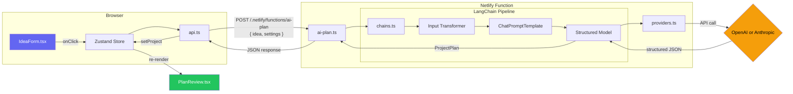

---

## Summary: What LangChain Replaces

| Concern | Without LangChain | With LangChain |
|---------|-------------------|----------------|
| Provider switching | Two separate API implementations | `getModel(settings)` returns either |
| Structured output | Manual JSON parsing + validation + retry | `.withStructuredOutput(zodSchema)` |
| Prompt management | String concatenation | `ChatPromptTemplate` with typed variables |
| Input transformation | Scattered across handler code | Declarative object in `RunnableSequence` |
| Pipeline composition | Nested callbacks or imperative steps | `RunnableSequence.from([...])` |

DevForge uses LangChain for **sequential intelligent chains** -- not multi-agent graphs, not complex routing, not memory/retrieval. It is the simplest useful subset of LangChain: prompt + model + structured output, composed cleanly.
